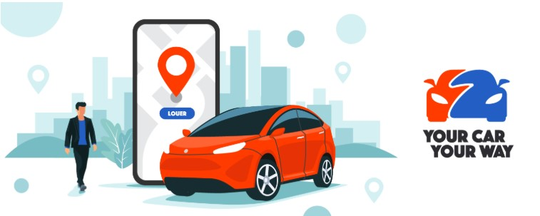
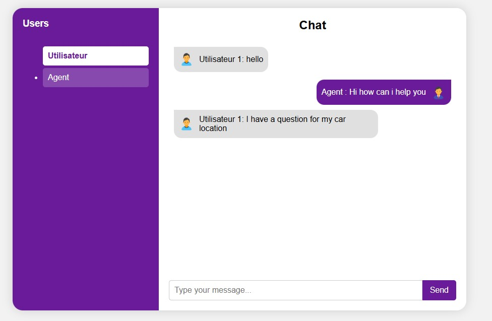

# Chat Proof of Concept (PoC)

This repository contains a Proof of Concept (PoC) for a chat functionality, developed for the **Your Car Your Way** project. The goal is to validate the technical feasibility of synchronous communication between a customer and a support agent via a web application.

## Technologies Used

### Backend (Spring Boot)
- **WebSocket**: A bidirectional communication protocol that allows for real-time data exchange between the server and clients.
- **STOMP** (Simple Text Oriented Messaging Protocol): A higher-level messaging protocol that runs over WebSocket, providing a structured way to handle messages.
- **SockJS**: A JavaScript client library that emulates the WebSocket protocol, ensuring compatibility with browsers that may not fully support it.

### Frontend (HTML, CSS, JavaScript)
- **HTML/CSS**: For the structure and styling of the chat user interface.
- **JavaScript**: To manage the chat's logic, including connecting to the server, sending messages, and updating the UI in real-time.
- **SockJS and STOMP Libraries**: Used on the client side to interact with the backend using the STOMP protocol over WebSocket.

## Getting Started

To run this PoC, you will need to:

1.  **Build the Java code**: Use `mvn clean install` or the equivalent command in your IDE.
2.  **Run the Spring Boot application**: `mvn spring-boot:run` The application will start on `http://localhost:8080` (the default port).
3.  **Access the interface**: Open `http://localhost:8080` in your web browser. You can open multiple tabs or browsers to simulate a conversation between different users.

